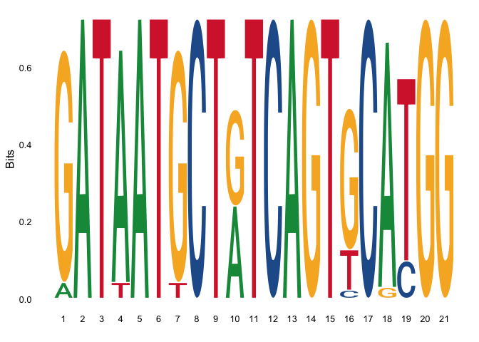

BlastBioinformatics\_Week3: Sequence Logos
================
Neera Patadia
09/02/2022

## Getting Familiar With R

This is an R Markdown document. Markdown is a simple formatting syntax
for authoring HTML, PDF, and MS Word documents. For more details on
using R Markdown see <http://rmarkdown.rstudio.com>.

When you click the **Knit** button a document will be generated that
includes both content as well as the output of any embedded R code
chunks within the document.

### R basics

Before getting into the sequence logo tutorial for this week, lets try
and get a bit familiar with the R programming language\! Lets start off
by printing out text\! To do this, we can use the `print()` command.

``` r
print("Hello World")
```

    ## [1] "Hello World"

Notice that the words we want to print are enclosed in quotation marks\!
This tells R that we are printing out something called a *string*.

Now you try\! Use the `print()` command to print out any phrase you
want\!

``` r
##Write your code here!
```

When programming, A lot of the time, we want the computer to remember a
particular value. We can do this by assigning the value to something
called a *variable*. You may have heard of variables before in your math
classes, were you can say something like `x = 7`. Then if you have an
equation like `x + 5`, we know the answer will be `12` because `7 + 5
= 12`. Lets see this in action in R\!

``` r
x = 7
x + 5
```

    ## [1] 12

When working with computers, *variables* can be more than just numbers.
They could also be a *string* or something more complicated like a
*matrix* or *dataframe*. Practice assigning different values to
variables below.

``` r
##Write your code here!

##variable containing a number 

##variable containing a string
```

In R, we can use the `typeof()` command to see whether what the *type*
of the variable is - that is whether it is a string, a number, a
dataframe and so on\! Try out the command below\!

``` r
##Write your code here!
```

### R Data Manipulation

A big part of bioinformatics is learning how to work with and
manipulated our data. Lets take a few moments to learn how to do this.

To start off, lets load in an R dataset into a data structure called a
`dataframe`. In this case, we will be working with the `nums` dataset,
which should have download already as a `.tsv` file. As an fyi, a `.tsv`
file is a table where every value is separated by a tab space. To load
in the file, we will use the `read.table()` command. Notice how we need
to assign the file to a variable.

``` r
read.table("nums.txt")
```

    ##           V1        V2         V3         V4
    ## 1  0.2073312 1.0852794  1.1890723 0.08330438
    ## 2 -1.1106609 0.2563358  0.7238336 1.31054725
    ## 3  1.2647419 0.2798932 -0.4442040 0.23810636

Now that we have read in the dataframe, we can

## Loading In Libraries

This week, we will be working with the `ggSeqLogo` package, along with a
few others. If you have not installed the packages listed below before,
remove the `#` when running the code block to install them. A package
can be though of as a bit of code written by another person, we can use
for our own analyses. To use packages in R, we need to first install
them. Once they are installed, they can be loaded into the program using
the `library` function.

    ## Warning: package 'Biostrings' was built under R version 4.0.3

    ## Loading required package: BiocGenerics

    ## Warning: package 'BiocGenerics' was built under R version 4.0.5

    ## Loading required package: parallel

    ## 
    ## Attaching package: 'BiocGenerics'

    ## The following objects are masked from 'package:parallel':
    ## 
    ##     clusterApply, clusterApplyLB, clusterCall, clusterEvalQ,
    ##     clusterExport, clusterMap, parApply, parCapply, parLapply,
    ##     parLapplyLB, parRapply, parSapply, parSapplyLB

    ## The following objects are masked from 'package:stats':
    ## 
    ##     IQR, mad, sd, var, xtabs

    ## The following objects are masked from 'package:base':
    ## 
    ##     anyDuplicated, append, as.data.frame, basename, cbind, colnames,
    ##     dirname, do.call, duplicated, eval, evalq, Filter, Find, get, grep,
    ##     grepl, intersect, is.unsorted, lapply, Map, mapply, match, mget,
    ##     order, paste, pmax, pmax.int, pmin, pmin.int, Position, rank,
    ##     rbind, Reduce, rownames, sapply, setdiff, sort, table, tapply,
    ##     union, unique, unsplit, which.max, which.min

    ## Loading required package: S4Vectors

    ## Warning: package 'S4Vectors' was built under R version 4.0.3

    ## Loading required package: stats4

    ## 
    ## Attaching package: 'S4Vectors'

    ## The following object is masked from 'package:base':
    ## 
    ##     expand.grid

    ## Loading required package: IRanges

    ## Warning: package 'IRanges' was built under R version 4.0.3

    ## Loading required package: XVector

    ## Warning: package 'XVector' was built under R version 4.0.3

    ## 
    ## Attaching package: 'Biostrings'

    ## The following object is masked from 'package:seqinr':
    ## 
    ##     translate

    ## The following object is masked from 'package:base':
    ## 
    ##     strsplit

## Loading in your data

To start off, you will first need to load in your aligned sequence data
into the program. This can be done by using the `read.fasta()` command.
This command is quite similar to the `read.table()` function we were
using earlier in the tutorial, but is intended to be used specifically
when working with data in fasta files.

``` r
sequences <- read.fasta("/Users/neera/Downloads/sequence_aln.fasta", seqtype = "DNA")
```

explore the sequences that were just loaded in\!

Now you try\! Load in your aligned sequence file\! Remember to assign it
to a variable\!

``` r
##Write your code here!
```

## Formatting Your Data

Now that we have loaded in our aligned fasta sequences, we need to
format them in a way such that the sequences can be interpreted by the
functions we are using to make our sequence logo. To do this, we have to
use a loop to iterate through all the sequences in our file, and pull
out the sequences themselves, as well as the basepair region we are
interested in using to make our sequence logo. In this context, we are
selecting the 450 to 470 basepair region.

``` r
all_sequences  = list()
for (i in 1:length(sequences)){
  individual_sequence <- paste(sequences[[i]], collapse = "")
  individual_sequence <- substr(individual_sequence, 450, 470) 
  all_sequences[length(all_sequences) + 1] <- toupper(individual_sequence)
}
```

Now you try\! Modify the above code block with the basepair region you
are interested in examining from your sequences\! You will also need to
change some of the variable names in the code block.

``` r
##Write your code here!

all_mySequences  = list()
for (i in 1:length(sequences)){
  individual_sequence <- paste(sequences[[i]], collapse = "")
  individual_sequence <- substr(individual_sequence, 450, 470) 
  all_mySequences[length(all_mySequences) + 1] <- toupper(individual_sequence)
}
```

## Building the Position Weight Matrix

Now that we have our sequences properly formatted, we can go onto making
our Position Weight Matrix\! A position weight matrix is a table that
describes the frequency of nucleotides ( or ammino acids if we are
working with proteins). It is structured so the rows represent the
nucleotides we are calculating the frequency for and the columns
represent the positions of those nucleotides in the sequence region of
interest. While there are a few ways to perform the calculating of the
PWM values, in this tutorial, we will be using the `consensusMatrix()`
function.

``` r
all_sequences <- unlist(all_sequences, use.names=FALSE)
string_set <- DNAStringSet(all_sequences)
PWM <- consensusMatrix(string_set, as.prob = TRUE)
```

Investigate the position weight matrix using the `View()` command. What
do you see?

Now try and build a PWM using your own data\!

``` r
##Write your code here!
```

## Making the Sequence Logo

Now that you have your PWM we can use the `seqlogo()` to make your
sequence logo. In the `seqlogo()` function, you will need to pass in
your position weight matrix, as well as the type of data you are working
with (DNA, RNA, amino acids)

    ## Warning: `guides(<scale> = FALSE)` is deprecated. Please use `guides(<scale> =
    ## "none")` instead.

<!-- -->

Now make your own sequence logo\! Analyze it to see which nucleotides
are highly conserved in the sequence\!

``` r
##Write your code here!
```
